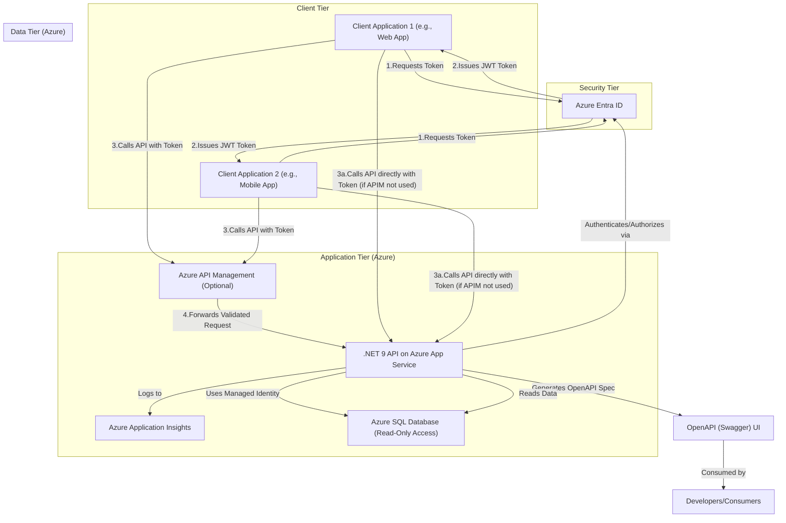
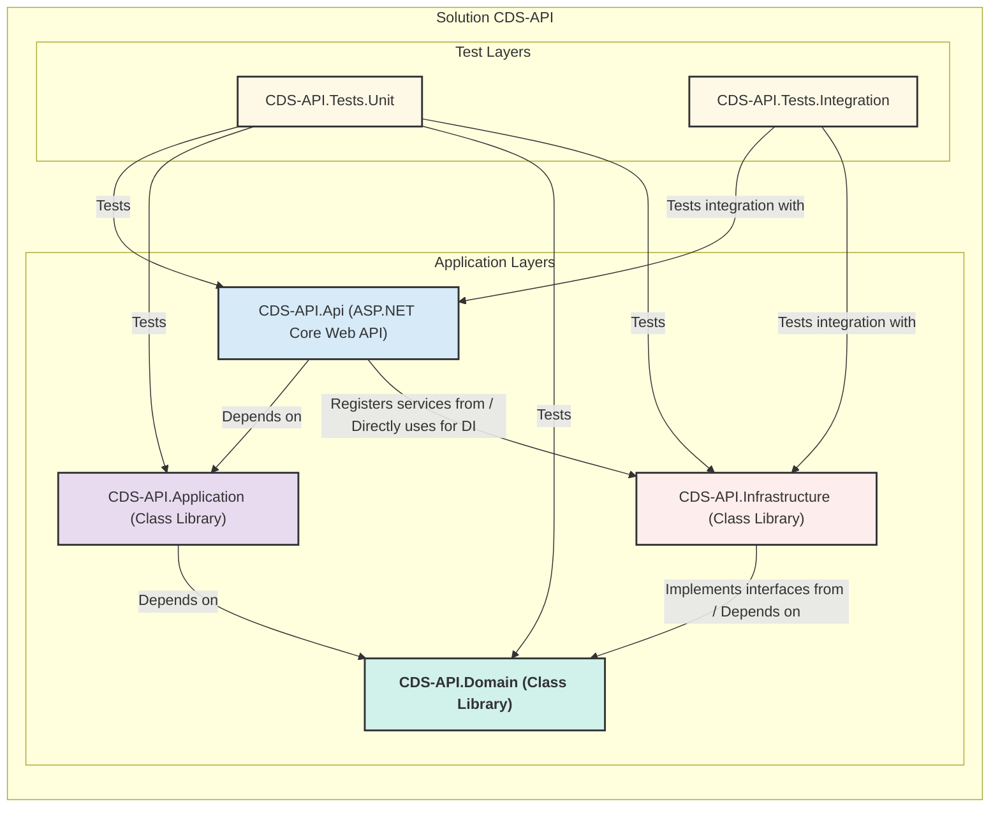

# CDS API

## Dependencies

| Name                    | Description                                                      |
|-------------------------|------------------------------------------------------------------|
| Azure Entra ID          | Identity provider for authentication and authorization.<br>Mocked by [Keycloak](./docs/mocks/authentication/Keycloak%20setup.md) for local development/testing. |
| Azure SQL Database      | Provides read-only access to application data.                   |
| Azure Application Insights | Logging and monitoring. |

## Overall Architecture



## Projects structure



**Explanation of the Diagram:**

- **`CDS-API.Api`**: This is your entry point, handling HTTP requests, hosting OpenAPI docs, and configuring services like Entra ID auth and App Insights. It depends on the `Application` layer for business logic. It might also directly reference -Infrastructure` to register specific services like the `DbContext`.
- **`CDS-API.Application`**: Contains your application services, DTOs, and orchestrates calls to the domain/infrastructure layers. It depends on the `Domain` layer for entities and repository interfaces.
- **`CDS-API.Domain`**: The core of your application. It contains business entities, domain service interfaces, and repository interfaces. It has **no dependencies** on other projects in the solution, making it highly reusable and independent.
- **`CDS-API.Infrastructure`**: Implements data access logic (repositories using EF Core or Dapper to talk to SQL Server) and any other external service interactions. It depends on the `Domain` layer to implement its interfaces.
- **`CDS-API.Tests.Unit`**: Contains unit tests for all layers, focusing on isolated component testing with mocks/stubs.
- **`CDS-API.Tests.Integration`**: Contains tests that verify interactions between layers, particularly the API endpoints and their connection to the database.

This structure promotes:

- **Clear Separation of Concerns:** Each project has a distinct responsibility.
- **High Cohesion:** Related code is kept together.
- **Low Coupling:** Changes in one layer (e.g., database technology) are less likely to ripple through the entire application, provided interfaces are maintained.
- **Testability:** Easier to write focused unit and integration tests.
- **Maintainability:** Simpler to understand, debug, and evolve the codebase.

### Where to Place Common Types

- **Request/Response DTOs:** Place in `CDS-API.Application`
- **Domain Entities:** Place in `CDS-API.Domain`
- **EF Core Models/Configurations:** Place in `CDS-API.Infrastructure` (if different from domain entities)

This approach keeps your architecture clean and maintainable.

### Data Contract for the APIs

You should name your data contract classes clearly to indicate their purpose and direction. The common convention is:

- **For requests:**  
  `{Action}{Entity}Request`  
  *Example:* `GetCoursesRequest`, `CreateCourseRequest`, `UpdateUserRequest`

- **For responses:**  
  `{Action}{Entity}Response`  
  *Example:* `GetCoursesResponse`, `CreateCourseResponse`, `UpdateUserResponse`

If the action is obvious from the context (e.g., for simple DTOs), you can use `{Entity}Dto` or `{Entity}DetailsDto` for response models.

**Summary:**  

- Use `Request` and `Response` suffixes for clarity.
- Use `Dto` suffix for general-purpose data transfer objects.

**Examples:**  

- `GetCourseRequest`, `GetCourseResponse`
- `CreateCourseRequest`, `CreateCourseResponse`
- `CourseDto`, `CourseDetailsDto`

### Validations for the Request models

If the validation logic is sophisticated, you should:

1. **Create a custom validator** using a library like [FluentValidation](https://fluentvalidation.net/) or implement `IValidatableObject` in your request model.
2. **Encapsulate complex rules** (e.g., conditional requirements, cross-field validation, value ranges, regex, etc.) in a dedicated validator class.
3. **Register the validator** in your DI container.
4. **Let the framework or middleware handle validation** and return standardized error responses.

**Example using FluentValidation:**

````csharp
using FluentValidation;
using CDS_API.Application.DTOs;

public class GetCoursesRequestValidator : AbstractValidator<GetCoursesRequest>
{
    public GetCoursesRequestValidator()
    {
        // At least one conditional field must be provided
        RuleFor(x => x)
            .Must(x => !string.IsNullOrWhiteSpace(x.CourseTitle) || !string.IsNullOrWhiteSpace(x.CourseCode))
            .WithMessage("Missing conditional field, must provide at least 1");

        // Example: Add more sophisticated rules here
        RuleFor(x => x.CourseCode)
            .Matches(@"^[A-Z]{2,5}\d{3}$")
            .When(x => !string.IsNullOrWhiteSpace(x.CourseCode))
            .WithMessage("CourseCode must match pattern (e.g., CS101)");
    }
}
````

**In your API project (Program.cs):**

````csharp
builder.Services.AddValidatorsFromAssemblyContaining<GetCoursesRequestValidator>();
builder.Services.AddControllers().AddFluentValidation();
````

**In your controller, just use the model:**

````csharp
[HttpPost("get-courses")]
public IActionResult GetCourses([FromBody] GetCoursesRequest request)
{
    if (!ModelState.IsValid)
        return BadRequest(ModelState);

    // ...existing logic...
}
````

**Summary:**  

- Use a validation library for complex rules.
- Keep validation logic out of controllers.
- Return standardized error responses automatically.

### Data Mapping

You should put the AutoMapper mapping profile in the **CDS-API.Application** project, typically in a folder named `Mappings` or `Profiles`.

**Reason:**  

- The Application layer is responsible for orchestrating data flow between domain entities and DTOs.
- Keeping mapping profiles here keeps your mapping logic close to your DTOs and services.

**Example structure:**  

```text
CDS-API.Application/
  DTOs/
  Services/
  Validators/
  Mappings/         <-- Place mapping profiles here
    CourseProfile.cs
```

**Summary:**  

- Place mapping profiles (e.g., `CourseProfile`) in `CDS-API.Application/Mappings` (or `Profiles`).  
- Register the profiles in your DI setup (usually in CDS-API.Api).
